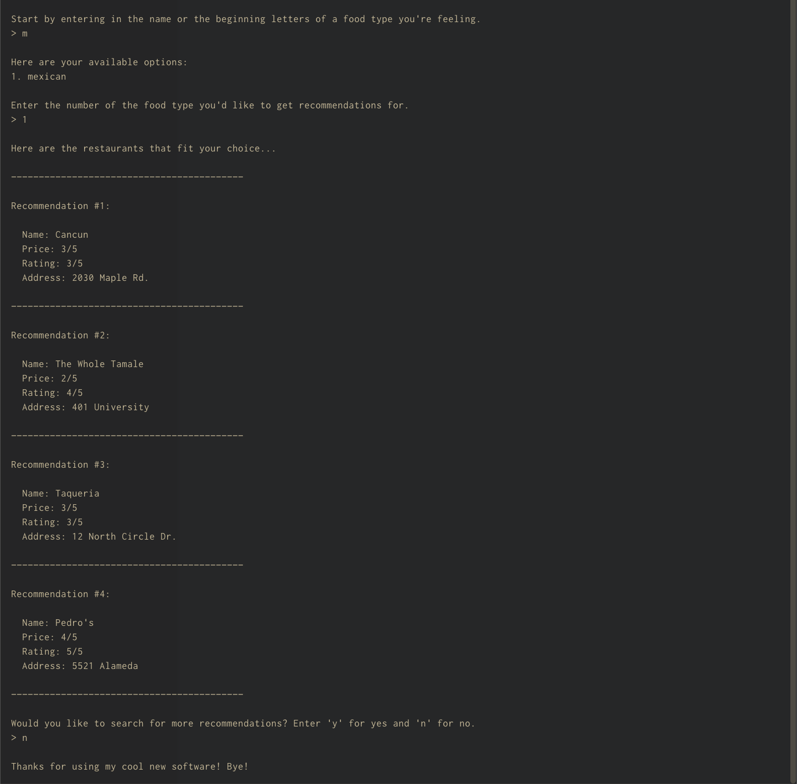

# Codecademy Portfolio Project: Recommendation Software App 

[Source Code](https://github.com/gflujan/recommendation-software-app)

# Overview 

This a terminal/CLI based app that takes in user input to select a food type that they're feeling. Then, based off of input, the app will provide restaurant "recommendations" from it's internal data. 

# Technology 

This was written in Python 3. 

It's a straightforward app in that it just takes in user input and then filters out pre-defined restaurant data that's stored in a local file. 

# Screenshots 

